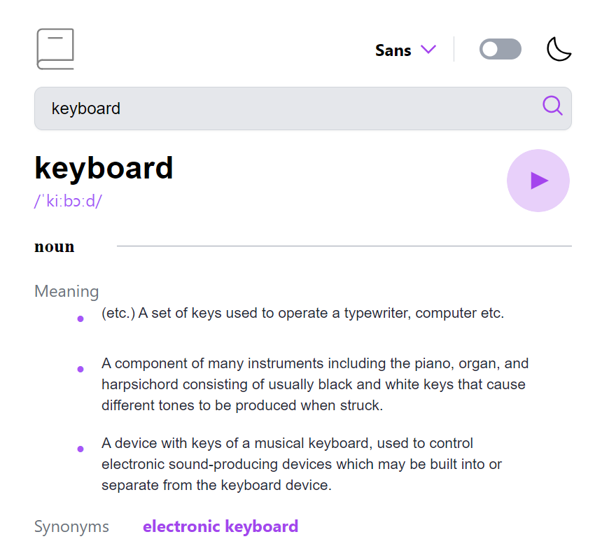
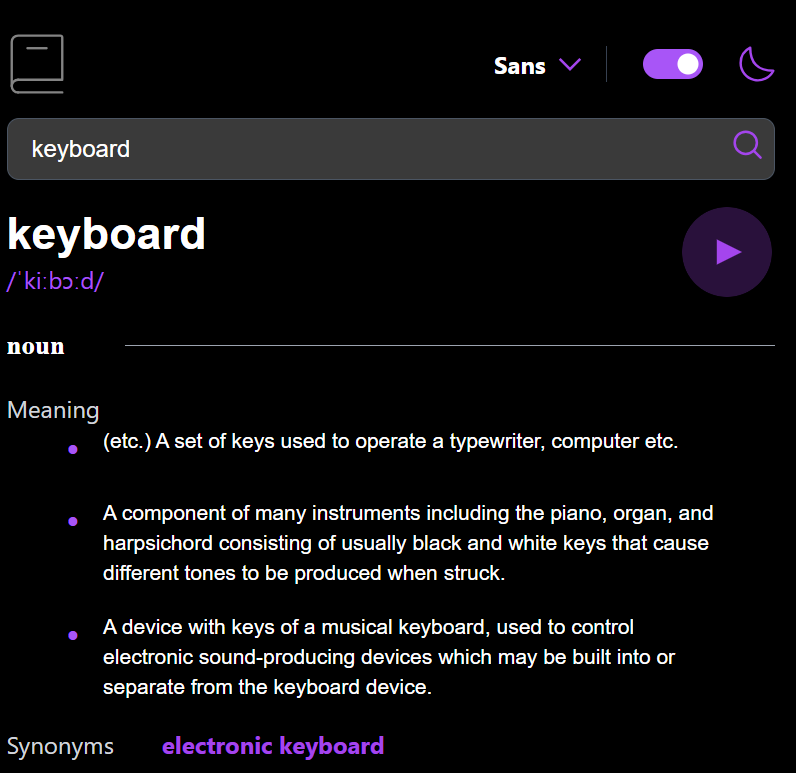
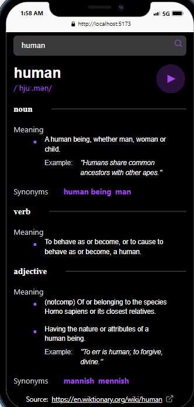

# Dictionary App

The Dictionary App is a sleek and intuitive React-based web application that allows users to search for the meanings, synonyms, and pronunciations of words. It leverages the powerful Dictionary API to fetch and display word definitions in a user-friendly interface.

## Features

- **🔍 Search Functionality**: Seamlessly search for any word and get its definition, part of speech, synonyms, and example usage.
- **🔊 Phonetic Pronunciation**: Get phonetic transcriptions and listen to the correct pronunciation of words.
- **🌗 Theme Toggle**: Easily switch between light and dark themes to suit your preference.
- **🔤 Font Selection**: Choose between different fonts (Sans, Sans Serif, Mono) for a personalized reading experience.
- **📱 Responsive Design**: Optimized for both desktop and mobile views for a seamless experience across all devices.

## Screenshots

### Light Theme


### Dark Theme


### Mobile View


## Technologies Used

- **React**: JavaScript library for building user interfaces.
- **Tailwind CSS**: Utility-first CSS framework for styling.
- **Dictionary API**: An API to fetch word definitions and related information.

## Installation

To run the Dictionary App locally, follow these steps:

1. **Clone the repository:**
   ```bash
   git clone https://github.com/mosesfuraha/dictionary-app
   cd dictionary-app
